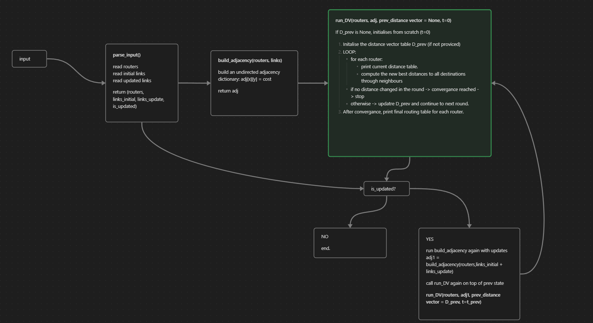

A graph explaining my code architecture is in architecture.png.

I have also provided an architecture_explanation.txt to provide details, 
and elaborate on why I scrapped my previous implementation of run_DV(),
and what I changed when doing the new (current) implementation.
Because I am unsure if I included enough details about this in the commit logs.

